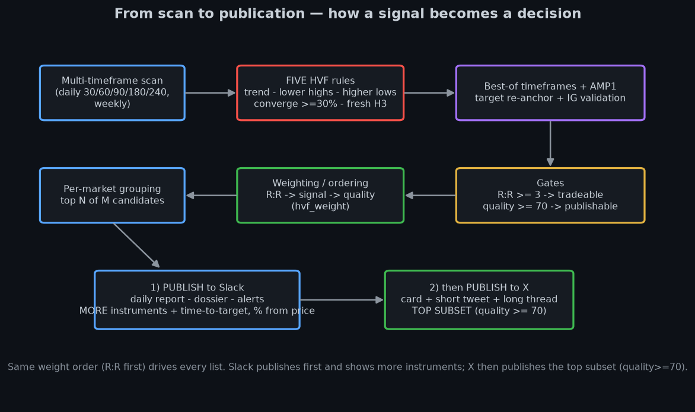
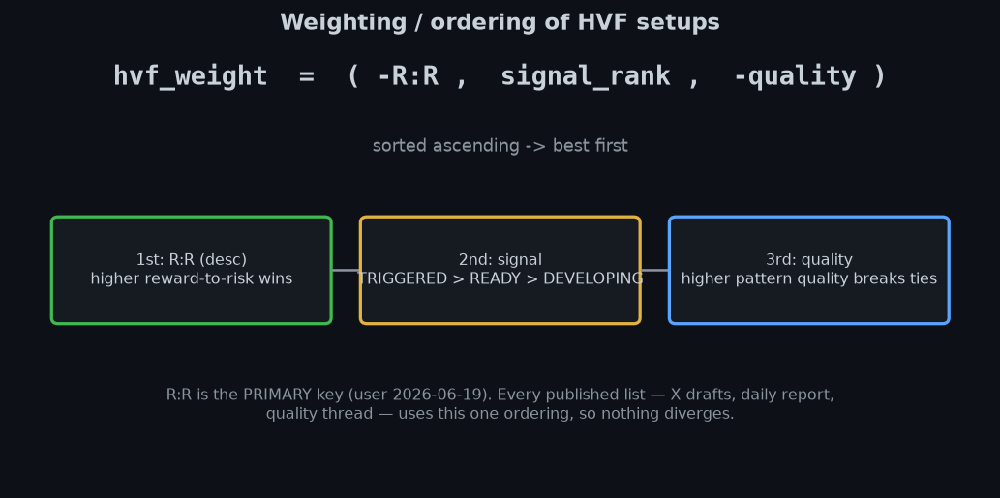

# From a signal to a decision — weighting & publication

How a detected squeeze (see [SQUEEZE_METHOD.md](SQUEEZE_METHOD.md)) becomes an ordered, gated, published
decision. Generated from the live code (`hvf_clean.detect_hvf`, `price_action.hvf_weight`,
`config.py`, `intraday_signals.py`, `run_hvf_report.py`).



## The pipeline

1. **Scan** every timeframe (daily 30/60/90/180/240 + weekly).
2. **Detect** with the single clean RW ruleset (`hvf_clean.detect_hvf`, cut over 2026-06-22): strict
   alternating swings, a real L3 (no synthetic), no flat-top tolerance, no Method-A/B override,
   squeeze **tightness ≤ 35%**, **R:R ≥ 3** — one engine for every timeframe. See the method doc.
3. Keep the **best** timeframe and validate against IG. The target is AMP1 = H1−L1 measured from
   midpoint(H3, L3), taken from the squeeze's own pivots (the earlier exhaustion-AMP1 re-anchor was
   removed in the 2026-06-22 cut-over; the weekly timeframe's ~3-year reach still catches
   long-formed squeezes whose true exhaustion top predates the daily windows).
4. Apply the **gates**: `R:R ≥ 3` decides *tradeable vs developing*; `quality ≥ MIN_PUBLISH_QUALITY`
   (now **25**) decides *publishable to X*.
5. **Order** every candidate by the single weighting key below.
6. **Group per market** and show the top *N* of *M* candidates.
7. **Publish** — to **Slack first** (daily report, dossier, alerts — *more* instruments, with
   current price, % distance and expected time-to-target), then **X** (card + short tweet + long
   thread — the *top subset*, quality ≥ 70 only, no data‑source names).

## Execution — live IG working orders (circuit-breaker guarded)

The Squeeze path now places **live IG working orders directly** — it no longer just posts *candidate*
orders for a downstream service. Two triggers, both routed through the same guarded
`ig_shim.place_hvf_order_from_sig`:

- the **automatic bridge** (`hvf_web/order_bridge.py`, every ~2h): READY setups inside the 1.5%
  proximity band and above the working-order quality floor (`WO_MIN_QUALITY` = 50) become PENDING
  orders on IG, up to 6 per pass;
- the **manual "Place on IG"** button in the web app (`/api/place-order`).

Every placement first clears `ig_shim.check_circuit_breakers` (daily-loss limit, max open positions,
spread) plus the per-source execution toggles and per-user trade filters, and uses the **acting
user's own IG account** (owner = env credentials; a non-owner must have supplied their own, else it
is blocked). Working orders expire after a configurable lifespan (default 28 days).

*(A separate `TradingViewWebhook` service still exists for other, non-Squeeze signals; it is no longer
the execution path for Squeeze setups.)*

## The weighting calculation

There is **one** canonical sort key, `price_action.hvf_weight`, used by every list so nothing
diverges:



```python
def hvf_weight(signal, quality, risk_reward=0.0):
    rank = {"TRIGGERED": 0, "READY": 1, "DEVELOPING": 2}.get(signal, 3)
    return (-(risk_reward or 0), rank, -(quality or 0))   # sort ascending -> best first
```

Read it as a priority tuple, compared left-to-right:

1. **R:R, descending** — the primary focus (user 2026-06-19). Higher reward-to-risk wins outright.
2. **Signal state** — `TRIGGERED` (already broken out) beats `READY` beats `DEVELOPING`.
3. **Pattern quality, descending** — breaks any remaining tie.

Because the key is shared, the X drafts, the daily Slack report and the long quality thread all rank
identically. Changing the rule in one place changes every list.

## The gates (what each constant does)

| Constant (source) | Default | Effect |
|---|---|---|
| `MIN_RISK_REWARD` (`config.py`) | 3.0 | Below it a squeeze is **DEVELOPING** (watch), not tradeable. |
| `MIN_PUBLISH_QUALITY` (`config.py`) | 25 | Setups below it are **not published** to X / live-X (lowered 70→25 on 2026-06-22 — the clean RW rules already gate hard on structure, so quality is a softer ranking floor). |
| `X_DRAFT_PER_MARKET` (`config.py`) | 5 | Top-5 per market are drafted to the X-drafts channel. |
| `X_PUBLISH_TOP_N` (`config.py`) | 2 | Top-2 per market of the changed set auto-publish to live X. |
| `PER_MARKET_TOP_N` (`config.py`) | 10 | Top-10 per market shown in the analytical Slack report. |

## What each contributes to the decision

- **R:R** — dominant. It is *why* one setup outranks another and is shown on every surface.
- **Signal state** — readiness/timing: a TRIGGERED break is actionable now; DEVELOPING is a watch.
- **Quality** — confidence in the *shape*; also the publish floor.
- **Convergence & freshness** — feed quality and the "is this still current?" read.
- **AMP1** — sets the target (and therefore the R:R the whole order depends on).
- **Fundamentals & ownership** — context in the dossier/long report (sales/profit/cash, analyst
  target, a large single holder such as a Berkshire-style >20% stake), not a gate.

## Change-detection & "seen before"

A published instrument is only **re-published** when a level moves (entry/stop/target) — keyed by
`intraday_signals._levels_fp`. A republish is tagged "👀 Seen before" with the exact delta; when
nothing has changed the top set is re-shown under a "nothing new" banner rather than spamming.

---
*Visuals regenerated by `docs/_gen_doc_visuals.py` — the decision-flow / weighting PNGs predate the
2026-06-22 clean-ruleset cut-over and the direct-IG execution change, so regenerate them to match.
Text last updated 2026-07-10.*
