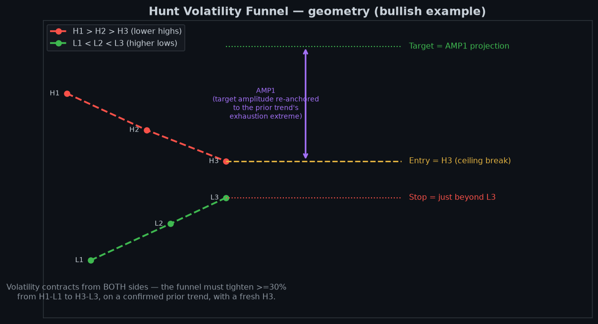

# The Squeeze — rules, thresholds & AMP1

This is the reference for *how a setup is detected and scored*. It is generated from, and kept
in step with, the live code in `price_action.py` (`get_hvf_signal` / `get_hvf_signal_mtf`).
The companion doc [DECISIONS_AND_WEIGHTING.md](DECISIONS_AND_WEIGHTING.md) covers how a detected
setup is then ordered, gated and published.

## What The Squeeze is

The Squeeze is a *continuation* pattern: after a confirmed trend, price coils into a
tightening range — a series of **lower highs** pressing down on a series of **higher lows** — until
it breaks out and (often) runs. The screen looks for this shape across several timeframes and keeps
the best one.

## The five rules (with thresholds)

Every emitted funnel satisfies **all five**. The per-instrument status of each is shown in the
dossier (`instrument_dossier._hvf_rules_block`).

| # | Rule | Threshold (source of truth) |
|---|------|------------------------------|
| 1 | **Prior trend confirmed** | uptrend → bullish funnel, downtrend → bearish (not sideways) |
| 2 | **Lower highs** | `H1 > H2 > H3` (the ceiling is falling) |
| 3 | **Higher lows** | `L1 < L2 < L3` (the floor is rising) |
| 4 | **Funnel converges** | width contracts **≥ 30%** from `H1−L1` to `H3−L3` (i.e. convergence ratio `< 0.70`) |
| 5 | **Fresh breakout pivot** | `H3` formed **within 60 bars** (stale pivots are rejected) |

After detection, a setup must also clear the **tradeability gate** — `R:R ≥ MIN_RISK_REWARD`
(`config.MIN_RISK_REWARD`, currently **3.0**). Below it the funnel is valid but flagged
**DEVELOPING** (watch, don't trade) rather than **READY/TRIGGERED**.

> The thresholds above are read from `price_action.py` and `config.py` at runtime — the dossier and
> reports never hardcode them. If `MIN_RISK_REWARD` changes, every surface follows automatically.

## Entry, stop and target

- **Entry** = `H3` for a bullish funnel (a break of the ceiling), `L3` for a bearish funnel.
- **Stop** = just beyond the opposite third pivot (`L3 − 0.2%` bullish, `H3 + 0.2%` bearish).
- **Target** = the **AMP1** projection (below).

## AMP1 — the target amplitude

The raw funnel projects a target of roughly one pattern-height from the breakout. The system then
**re-anchors that amplitude to the prior trend's *true* exhaustion extreme** — Francis Hunt's
"AMP1" — rather than the in-window swing pivots. `apply_exhaustion_amp1()` (wired into
`get_hvf_signal_mtf`) finds the dominant high/low in roughly the 260 trading days before the
funnel's `H2` and measures AMP1 from that exhaustion point to the first natural-support pullback.

- Only the **target amplitude** is re-anchored; entry and stop stay at the funnel's third pivots.
- Only the chosen **best** timeframe carries the AMP1-anchored (and IG-validated) target/R:R. Other
  timeframes shown "also on …" carry their raw per-timeframe detection figures — they are context,
  not the headline trade.

## Multi-timeframe selection

`get_hvf_signal_mtf` runs the detection on **daily-240, daily-180, daily-90, daily-60, daily-30 and
weekly**, then keeps the best result by **TRIGGERED > READY > DEVELOPING, then highest quality**.
The winning timeframe is recorded in `hvf_timeframe`.

## Quality score

`pattern_quality` (0–100) is a composite: tighter convergence and a fresher `H3` score higher. It is
used as the final tie-breaker in ordering (see the weighting doc) and as the **publication floor**
(`MIN_PUBLISH_QUALITY = 70`): setups below 70 are not published to X.

---
*Visuals regenerated by `docs/_gen_doc_visuals.py`. Last updated 2026-06-19.*
