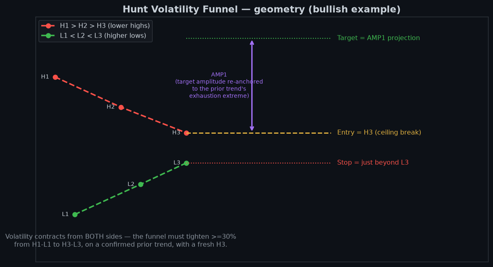

# The method — detection, scoring, ranking

How a setup is detected, scored, ranked and turned into an order. Read from the code on 2026-10-08:
`hvf_clean.detect_hvf` (detection), `price_action.get_hvf_signal_mtf` (timeframe choice),
`price_action.hvf_weight` (ranking), `config.py` (thresholds). **The code wins any disagreement** — three
of the numbers below are checked against `config.py`/`hvf_clean.py` by `test_hvf_method.py`, so this file
fails the suite if it drifts.

## The pattern

A continuation pattern. After a clear trend, price coils: three **lower highs** (H1 > H2 > H3) interleaved
with three **higher lows** (L1 < L2 < L3), then breaks out in the trend's direction.

## Detection — `hvf_clean.detect_hvf`, one engine for every timeframe

| # | Rule | Exactly as coded |
|---|---|---|
| 1 | Clear prior trend | `get_trend_structure` must say UPTREND/STRONG_UPTREND (→ bullish) or DOWNTREND/STRONG_DOWNTREND (→ bearish). Anything else is rejected. **No magnitude floor is applied**: `MIN_PRIOR_TREND_PCT` is imported but never checked (see `BACKLOG.md`, prior-trend gate). |
| 2 | Three alternating swings | Real swing pivots (±5 bars, and ±3 daily / ±2 weekly). **Strict** H1 > H2 > H3 and L1 < L2 < L3 < H3 — no flat-top tolerance, no synthetic L3. |
| 2a | Freshness and span | H3 within 60 daily / 40 weekly bars; H1→H3 spans at least 10 daily / 4 weekly bars. |
| 3 | Tightness | (H3 − L3) / AMP1 must be ≤ `HVF_TIGHTNESS_MAX`, currently **0.35** (`hvf_clean.py:46`). |
| 4 | Levels | AMP1 = H1 − L1. Mid = (H3 + L3) / 2. Bullish: entry H3, stop L3 × 0.998, target Mid + AMP1. Bearish: entry L3, stop H3 × 1.002, target Mid − AMP1. A non-positive target is rejected. |
| 5 | R:R | \|target − entry\| / \|entry − stop\|, from the ENTRY, never the current price. Below `MIN_RISK_REWARD` (currently **3.0**) the setup is DEVELOPING, not tradeable. |

**Signal state.** DEVELOPING if R:R is under the floor; otherwise TRIGGERED if the **latest close** is beyond
the entry (above H3 bullish, below L3 bearish), else READY. There is no weekly-close confirmation in the
code, despite the module header saying so.

**Quality (0–100)** = `(1 − tightness/0.35) × 50` + `max(0, 30 − bars since H3)` + up to 20 for swing
symmetry, capped at 100. It ranks; it does not gate detection.

**Removed on 2026-06-22**, still described in older notes: the exhaustion-AMP1 re-anchor
(`apply_exhaustion_amp1`), the 0.70 convergence ratio, flat-top/flat-base tolerance and the recent-trend
override. The clean engine replaced all of them.

## Choosing the timeframe — `get_hvf_signal_mtf`

Runs detection on daily-240, daily-180, daily-90, daily-60, daily-30 and weekly. Then:

1. Drops a TRIGGERED candidate whose price has run past its target or more than `STALE_TRIGGER_MAX_PCT`
   (20%) beyond its entry — the funnel resolved long ago. Logged to `hvf_suppressed_log`.
2. Keeps the best by signal state (TRIGGERED > READY > DEVELOPING), then quality.
3. `check_hvf_invariants` suppresses any result that breaks its own geometry (negative target, inverted
   funnel, stop on the wrong side). It never reaches Slack or an order.

## Ranking — one key everywhere

`price_action.hvf_weight(signal, quality, rr)` = `(-rr, state rank, -quality)`, sorted ascending:
**R:R first**, then TRIGGERED > READY > DEVELOPING, then quality. Every list — reports, X drafts, quality
threads — uses it, so they cannot disagree.

## Gates and publication

| Constant | Value | Effect |
|---|---|---|
| `MIN_RISK_REWARD` | 3.0 | below → DEVELOPING (watch only) |
| `MIN_PUBLISH_QUALITY` | 25 | below → not published to X. `MIN_PUBLISH_QUALITY`, currently **25** |
| `PER_MARKET_TOP_N` | 10 | per-market rows in the Slack report |
| `X_DRAFT_PER_MARKET` / `X_PUBLISH_TOP_N` | 5 / 2 | X drafts / auto-published per market |
| `bridge_min_quality` (`app_config`) | code default 50; the live value is DB state — read it, do not quote this | Order Bridge auto-load floor |

## From setup to order

The **Order Bridge** (`hvf_web/order_bridge.py`, cron `0 6-22/2 * * 1-5`) is the only enabled execution
source. READY setups within the proximity band and above `bridge_min_quality` become IG working orders at
the exact entry, with stop and target attached. Every placement passes `ig_shim.check_circuit_breakers`.
Lifecycle WATCHING → PENDING → FILLED / CANCELLED / EXPIRED lives in `working_orders`; only
`working_order_state.classify` may interpret a row's absence from IG's book.

Break-bar measures (RVOL, VolumeScore, above-VWAP, ATR-expanding) cannot gate a pre-placed order — orders
reach IG a median 8 days before the break. See `docs/ORDER_TIMING_AND_RVOL.md` before touching them.

## Fidelity to Francis Hunt's public method

The pattern, entry and target formula match Hunt's public definition word for word ("the distance between
the first high and the first low measured from the midpoint between the third high and the third low").
The 0.35 tightness and the 3.0 R:R floor are **house** numbers — Hunt publishes neither. A hard broker stop
(rather than weekly-close invalidation) is a deliberate risk choice. Detail: `skills_src/ah-hvf-analysis/`.
